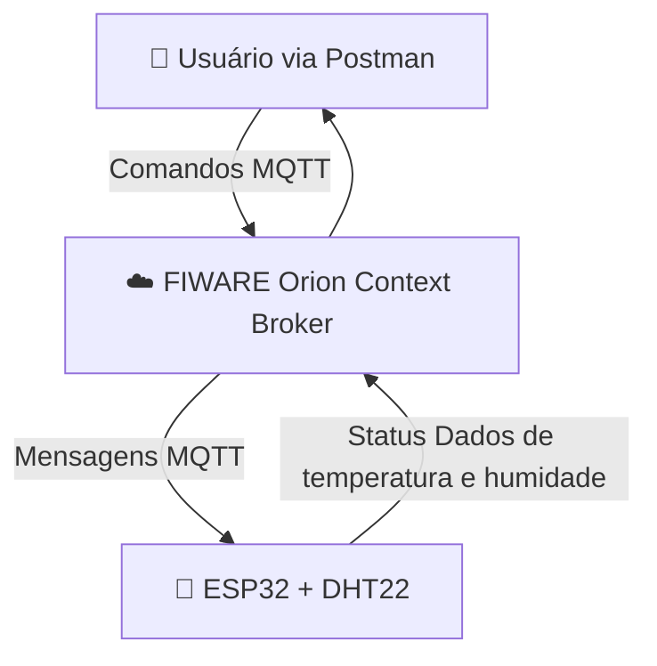

# ⚽ IoT para o Futebol Feminino – Estação Meteorológica com ESP32 + DHT22 + FIWARE + MQTT

## 📌 Visão Geral

Este projeto acadêmico integra **Internet das Coisas (IoT)**, **ESP32**, **MQTT** e a plataforma **FIWARE** para demonstrar como a tecnologia pode apoiar o **futebol feminino**. A iniciativa visa monitorar variáveis ambientais, como **temperatura** e **umidade**, que impactam diretamente o bem-estar das atletas durante treinos e jogos.

-----

## 🎯 Objetivo

  - Criar uma integração entre **hardware (ESP32 + DHT22)** e **software (FIWARE + Postman)**.
  - Monitorar **temperatura** e **umidade** em tempo real.
  - Publicar dados em um **broker MQTT** para análise.
  - Simular o funcionamento com o **Wokwi** antes da implementação física.

-----

## 🔍 Importância do Projeto

Muitas partidas e treinos de futebol feminino ainda ocorrem em horários de alta exposição ao calor, aumentando o risco de **fadiga, desidratação e queda de desempenho**. Este sistema oferece uma solução para:

  - Monitorar as condições climáticas em tempo real.
  - Gerar relatórios que auxiliam na **tomada de decisão sobre horários de treinos e partidas**.
  - Criar **alertas automáticos** quando a temperatura ou umidade atingem níveis de risco.
  - Apoiar iniciativas de **profissionalização e cuidado com a saúde das atletas**.

-----

## 🏗️ Arquitetura do Projeto



### 📸 Ilustração do Projeto
 


### 🔧 Componentes Utilizados

  - **ESP32:** Microcontrolador com Wi-Fi.
  - **Sensor DHT22:** Para medição de temperatura e umidade.
  - **Broker MQTT:** Para comunicação assíncrona.
  - **FIWARE Orion Context Broker:** Para gerenciamento do contexto e dos dados.
  - **Postman:** Para testes e interação com a API.
  - **Wokwi:** Para simulação de hardware.

### 📡 Tópicos MQTT

  - **Publicação (Temperatura):** `weather001/attrs/temperature`
  - **Publicação (Umidade):** `weather001/attrs/humidity`

-----

## 🚀 Passo a Passo de Execução

1.  **Configurar ambiente FIWARE:** Em uma máquina virtual (VM), configure o ambiente FIWARE usando Docker ou Azure.

2.  **Registrar o dispositivo:** Registre o dispositivo no IoT Agent com o modelo abaixo:

    ```json
    {
      "devices": [
        {
          "device_id": "weather001",
          "entity_name": "urn:ngsi-ld:WeatherStation:001",
          "entity_type": "WeatherStation",
          "protocol": "PDI-IoTA-UltraLight",
          "transport": "MQTT",
          "attributes": [
            { "object_id": "t", "name": "temperature", "type": "Number" },
            { "object_id": "h", "name": "humidity", "type": "Number" }
          ]
        }
      ]
    }
    ```

3.  **Programar o ESP32 (no Wokwi):**

      - Conectar ao Wi-Fi.
      - Conectar ao broker MQTT.
      - Ler valores de temperatura e umidade via DHT22.
      - Publicar os dados nos tópicos configurados.

4.  **Testar no Postman:**

      - Fazer um **GET** no endpoint: `http://<URL>:1026/v2/entities/urn:ngsi-ld:WeatherStation:001`
      - Visualizar os dados de temperatura e umidade atualizados.

-----

## 🖥️ Simulação no Wokwi

O projeto pode ser testado no Wokwi utilizando os seguintes componentes:

  - ESP32
  - Sensor DHT22

Basta importar o código e configurar o mesmo broker MQTT usado no FIWARE.

-----

## 📘 Boas Práticas

  - Utilizar tópicos MQTT padronizados (ex: `entity/attrs/sensor`).
  - Implementar reconexão automática para Wi-Fi e broker.
  - Normalizar dados para facilitar a análise (°C e %).
  - Documentar os endpoints utilizados no Postman.

### ⚠️ Possíveis Problemas e Soluções

  - **Erro 400 no Orion:** Verifique se o nome do atributo no código está igual ao configurado (`temperature`, `humidity`).
  - **Broker MQTT inacessível:** Cheque o IP e a porta.
  - **Sem atualização no Postman:** Confirme se o ESP32 está publicando os dados corretamente.

-----

## ✅ Considerações Finais

Este projeto demonstra como o **ESP32**, em conjunto com **MQTT** e **FIWARE**, pode criar soluções inteligentes para o futebol feminino. O monitoramento em tempo real da temperatura e umidade é um recurso crucial para preservar a saúde das atletas, mitigar riscos e garantir condições de treino mais seguras.

A arquitetura pode ser facilmente expandida para incluir sensores adicionais (luminosidade, qualidade do ar, índice UV), aprimorando ainda mais a proteção e o cuidado com as jogadoras.

-----

**Desenvolvido por:**

  - Rafael Augusto Carmona RM:563758
  - Eduardo Tolentino RM:562169
  - Enzo Hort Ramos RM:561872

**Professor:**

  - Fabio Enrique Cabrini

**Curso:** Engenharia de Software – FIAP

🔗 **Vídeo do projeto no YouTube:** [https://youtu.be/U8COodh2gUU]

🔗 **Simulação no Wokwi:** [https://wokwi.com/projects/442272409857155073]

🔗 **Repositório Git hub:** [https://github.com/rafa212007/sprint-3.git]


